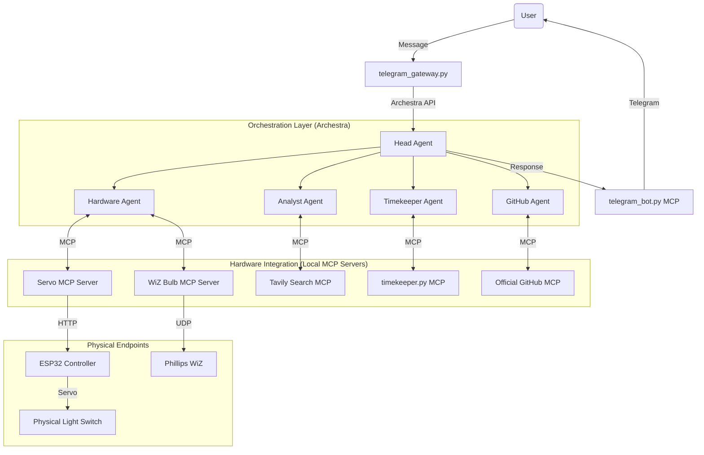

# Switcheroo

Switcheroo is an agentic environment control system that bridges digital triggers with physical stimuli. It utilizes the Model Context Protocol (MCP) and Archestra to enable AI agents to orchestrate physical room states—specifically lighting and mechanical switches—to facilitate presence and focus.

## Background

This project was born out of a desire to move beyond "smart-enough" devices that require manual interaction. By giving the room agency, Switcheroo ensures that important notifications or schedules manifest as unavoidable physical changes in the environment.

For a deeper dive into the motivation and story behind development, see [**And AI said, Let there be Light.**](./blog_post.md)

## Technical Architecture

The system is built on a hub-and-spoke model where a central **Head Agent** orchestrates specialized sub-agents. Communication between the orchestration layer and localized hardware controllers is handled via MCP servers running over HTTP/SSE.



### Core Components

*   **Ingress Flow**: Messages are received via Telegram by `telegram_gateway.py`, which forwards them to the Head Agent via the Archestra API.
*   **Egress Flow**: Agent responses are sent back to the user via the `telegram_bot.py` MCP server.
*   **Orchestration**: Managed via Archestra. The Head Agent receives natural language and routes to the appropriate specialist.
*   **Hardware Interface**:
    *   **Wiz Bulb**: Controlled via local UDP broadcasts using the [`pywizlight`](https://github.com/tristanpepin/pywizlight) library.
    *   **ESP32 Servo**: A custom Wi-Fi enabled controller that physically toggles non-smart wall switches using a standard servo motor.
*   **Specialist Agents**:
    *   **Timekeeper**: Handles scheduling and triggers via the `timekeeper.py` MCP.
    *   **Analyst**: Integrated with Tavily for real-time web research.
    *   **GitHub**: Monitors repository workflows using the official GitHub MCP.

## Hardware Configuration

### Switch Bot (ESP32)
The physical switch controller uses an ESP32 to drive a servo motor mounted to a standard wall switch.

*   **BOM**: ESP32 Dev Board, SG90 Servo, MicroUSB power.
*   **Pinout**: Servo VCC (5V), GND, Signal (GPIO 14).
*   **Firmware**: Located in `firmware/esp32_servo/`. Rename `config.example.h` to `config.h` and update WiFi credentials before flashing.

### Lighting (WiZ)
Requires a Phillips WiZ compatible bulb on the same local network. The IP address must be static or reserved in DHCP.

## Setup and Installation

### 1. Environment Preparation
Ensure Python 3.10+ and Docker are installed locally.

```bash
git clone https://github.com/arjunmukeshh/switcheroo.git
cd switcheroo
```

### 2. Dependency Management
Install required packages for the gateway and individual MCP servers:

```bash
pip install -r mcp_servers/telegram/requirements.txt
pip install -r mcp_servers/wiz_bulb/requirements.txt
pip install -r mcp_servers/servo/requirements.txt
pip install -r mcp_servers/timekeeper/requirements.txt
```

### 3. Orchestration Platform
Switcheroo requires Archestra to be running. Get started with Archestra [here](www.archestra.ai). Use the following quickstart to deploy the containerized platform:

```bash
docker run -p 9000:9000 -p 3000:3000 \
    -e ARCHESTRA_QUICKSTART=true \
    -v /var/run/docker.sock:/var/run/docker.sock \
    -v archestra-postgres-data:/var/lib/postgresql/data \
    -v archestra-app-data:/app/data \
    archestra/platform
```
In the platform's MCP Registry, configure the Github MCP and the Tavily MCP as well. 

### 4. Configuration
1.  Initialize the environment file: `cp .env.example .env`
2.  Populate `.env` with:
    *   `WIZ_BULB_IP`: Internal IP of the WiZ light.
    *   `ESP32_IP`: Internal IP of the servo controller.
    *   `TELEGRAM_BOT_TOKEN`: Token from @BotFather.
    *   `ARCHESTRA_API_KEY`: Derived from the Archestra dashboard.
    *   `ARCHESTRA_AGENT_ID`: The ID of your configured Head Agent.

### 5. Deployment
Launch the suite of MCP servers and the Telegram gateway:

```bash
python run_mcp_servers.py
```

## Usage Examples

*   **Morning Routine**: "Good morning, set me up." (Triggers lighting scene + brief).
*   **Reminders**: "Remind me in 10 minutes that the stove is on." (Triggers light pulse + physical switch cycle at T-0).
*   **Research**: "Check the status of the latest workflow in the `switcheroo` repo."

## License
MIT. Developed by [Arjun Mukesh](https://github.com/arjunmukeshh).
